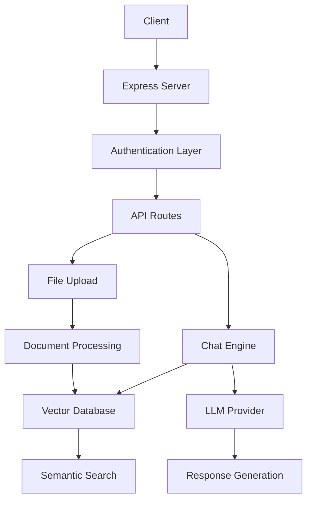

# ChatPDF 🤖📄

<div align="center">

[](https://nodejs.org/)
[](https://expressjs.com/)
[](https://langchain.com/)
[](https://cohere.ai/)
[](https://opensource.org/licenses/MIT)

**Intelligent Document Chat Interface**

Transform your documents into interactive conversations using AI-powered semantic search and natural language processing.

[🚀 Quick Start](#quick-start) • [📖 API Docs](#api-documentation) • [🛠️ Development](#development) • [🤝 Contributing](#contributing)

</div>

---

## ✨ Features

🔮 **Conversational AI** - Chat naturally with your documents using advanced language models  
📁 **Multi-Format Support** - Process PDF, DOCX, PPTX, and TXT files seamlessly  
🧠 **Semantic Search** - Fast, intelligent search using vector embeddings  
🔐 **Secure Authentication** - JWT-based security with Clerk integration  
⚡ **High Performance** - Built with Bun and Express for optimal speed  
🎯 **RESTful API** - Clean, well-documented endpoints  
📊 **Real-time Monitoring** - Health checks and performance metrics  
🚀 **Production Ready** - Comprehensive error handling and logging  

---

## 🏗️ Architecture



**Core Components:**
- **Express Server** - HTTP request handling and routing
- **Authentication** - JWT + Clerk for secure user management  
- **Document Processing** - LangChain-powered file parsing and chunking
- **Vector Database** - HNSWLib for fast semantic search
- **AI Engine** - Cohere LLM and embeddings for intelligent responses

---

## 🚀 Quick Start

### Prerequisites
- Node.js 18+ or Bun
- Cohere API key
- Supabase account (optional)

### Installation

1. **Clone the repository**
   ```bash
   git clone https://github.com/oovaa/ChatPDF.git
   cd ChatPDF
   ```

2. **Install dependencies**
   ```bash
   # Using Bun (recommended)
   bun install
   
   # Or using npm
   npm install --legacy-peer-deps
   ```

3. **Configure environment**
   ```bash
   cp .env.example .env.local
   ```
   
   Edit `.env.local` with your credentials:
   ```env
   COHERE_API_KEY=your_cohere_api_key
   SUPABASE_URL=your_supabase_url
   SUPABASE_KEY=your_supabase_key
   JWT_SECRET=your_jwt_secret
   ```

4. **Start the server**
   ```bash
   # Development mode
   bun run dev
   # or npm run dev
   
   # Production mode
   bun start
   # or npm start
   ```

5. **Test the API**
   ```bash
   curl http://localhost:3000/z
   ```

---

## 📖 API Documentation

### Base URL
```
http://localhost:3000/api/v1
```

### Authentication Endpoints

#### Sign Up
```http
POST /signup
Content-Type: application/json

{
  "username": "johndoe",
  "email": "john@example.com", 
  "password": "securepassword123"
}
```

#### Sign In
```http
POST /signin
Content-Type: application/json

{
  "login": "john@example.com",
  "password": "securepassword123"
}
```

### Document Management

#### Upload Document
```http
POST /upload
Content-Type: multipart/form-data

file: <PDF|DOCX|PPTX|TXT file>
```

**Response:**
```json
{
  "success": true,
  "file": {
    "name": "document.pdf",
    "type": "PDF",
    "size": "2.5MB"
  },
  "message": "File processed successfully",
  "metadata": {
    "processingTime": "1250ms",
    "timestamp": "2024-01-15T10:30:00Z"
  }
}
```

### Chat Interface

#### Send Message
```http
POST /send
Content-Type: application/json

{
  "question": "What is the main topic of this document?",
  "sessionId": "user123",
  "noDoc": false
}
```

**Response:**
```json
{
  "answer": "The document discusses...",
  "metadata": {
    "responseTime": "850ms",
    "chainType": "document_aware",
    "timestamp": "2024-01-15T10:31:00Z"
  }
}
```

### Health Check
```http
GET /z
```

For detailed API documentation, see [docs/API.md](docs/API.md).

---

## 🛠️ Development

### Project Structure
```
ChatPDF/
├── index.js                 # Application entry point
├── src/
│   ├── Routes/              # API endpoint definitions
│   ├── middleware/          # Custom middleware functions
│   ├── models/              # AI model configurations
│   ├── db/                  # Database and vector store
│   └── utils/               # Utility functions
├── docs/                    # Documentation
└── package.json
```

### Development Commands
```bash
# Start development server with auto-reload
bun run dev

# Format code with Prettier
bun run lint

# Run tests
bun test
```

### Environment Variables
See [.env.example](.env.example) for all available configuration options.

---

## 🚢 Deployment

### Docker (Recommended)
```bash
# Build image
docker build -t chatpdf .

# Run container
docker run -p 3000:3000 --env-file .env.local chatpdf
```

### Traditional Deployment
1. Set production environment variables
2. Install dependencies: `npm ci --only=production`
3. Start server: `npm start`

For detailed deployment instructions, see [docs/DEPLOYMENT.md](docs/DEPLOYMENT.md).

---

## 🤝 Contributing

We welcome contributions! Please see our [Contributing Guidelines](Contributing.md) for details.

### Quick Contribution Steps
1. Fork the repository
2. Create a feature branch: `git checkout -b feature/amazing-feature`
3. Make your changes and test them
4. Run linting: `bun run lint`
5. Commit your changes: `git commit -m "Add amazing feature"`
6. Push to your branch: `git push origin feature/amazing-feature`
7. Open a Pull Request

---

## 📝 License

This project is licensed under the MIT License - see the [LICENSE](LICENSE) file for details.

---

## 🙏 Acknowledgments

- **LangChain** - For powerful document processing capabilities
- **Cohere** - For state-of-the-art language models and embeddings
- **Supabase** - For reliable database infrastructure
- **Clerk** - For seamless authentication
- **Contributors** - Thank you to all our amazing contributors!

---

## 📞 Support

- 📖 [Documentation](docs/)
- 🐛 [Report Issues](https://github.com/oovaa/ChatPDF/issues)
- 💬 [Discussions](https://github.com/oovaa/ChatPDF/discussions)
- 📧 [Email Support](mailto:support@chatpdf.example.com)

---

<div align="center">

**Built with ❤️ by Omar, Husam, Mohayyad & Hassan**

[⭐ Star this project](https://github.com/oovaa/ChatPDF) if you find it helpful!

</div>