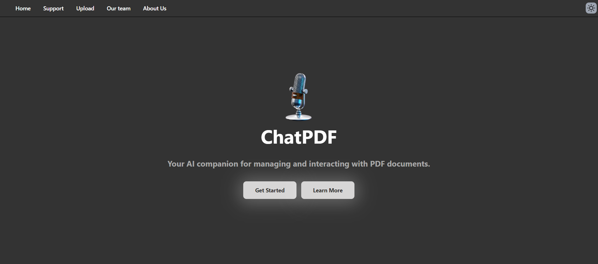
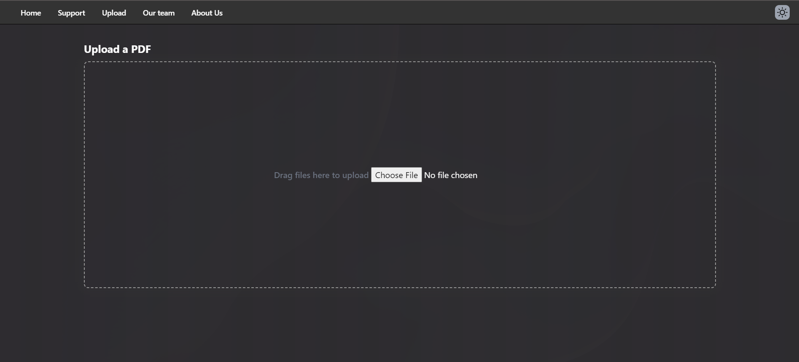
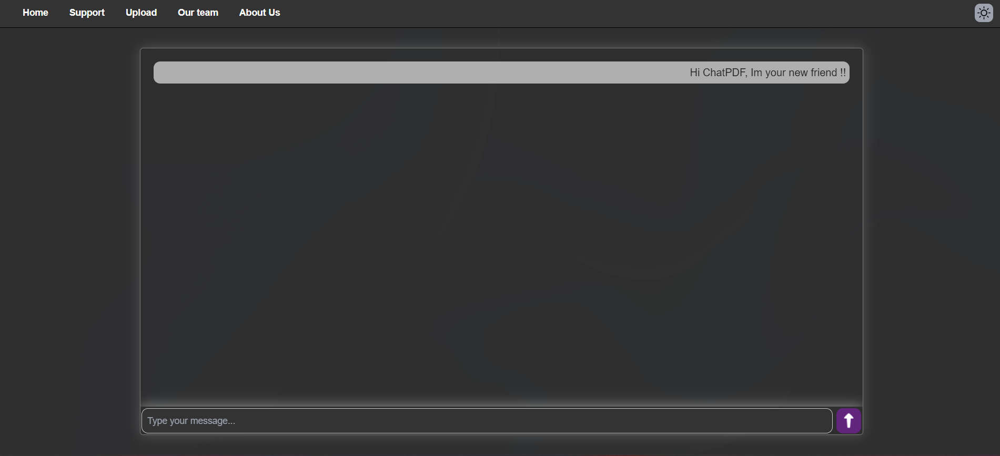

<h1 align="center">Hi There 👋, Welcome to ChatPDF</h1>
<h3 align="center">Your AI companion for managing and interacting with PDF documents 🔥</h3>

ChatPDF is a platform that merges the real-time chat communication with PDF documents. Users can interact with the PDF through a chat interface, where they can ask questions or request information related to the PDF content. The system utilizes advanced algorithms and Ai to understand user queries, retrieve relevant information from PDF files, and provide accurate responses. Whether it's summarizing content, or searching for specific information within PDF documents.

## Table of contents
- [The Story](#TheStory)
- [Getting Started](#getting-started)
- [Screenshots](#screenshots)
- [Features](#features)
- [Built with](#built-with)
- [License](#license)
- [Authors](#authors)

## The Story
During the pressures of college exams and our commitment to the ALX scholarship, we were all feeling the strain. It was during these moments of shared stress that the seed of our project was planted. We asked ourselves, "Why not create something that could help us easily understand files and engage with AI  just like we'd converse with another person?" We all found this idea incredibly exciting, realizing it can assist many people. And so, Powered by this shared vision, we started on our journey to bring this project to life.

## Getting Started

## Screenshots
Here are some screenshots from the website:

**Home Screen**

<!-- img src="readme-img/landing2.png" -->

**Upload page**

**Chat page**

## Features

## Built with
- js runtime  
  - bun

- Backend
  - Langchain framework
  - Express JS

- Frontend
  - Tailwind CSS 
  - HTML
  - Javascript

- Models
  - Cohere embedding 
  - Command R+ as the main llm

## Our Site and Blog article
- Site
- Blog post:

## Installation

To run ChatPDF locally, follow these steps:

1. Clone the repository: `git clone https://github.com/oovaa/ChatPDF.git`
2. Navigate to the project directory: `cd ChatPDF`
3. Install dependencies: `bun install`
4. Start the server: `bun dev run`

## Usage

Once the server is running, open your web browser and navigate to `http://localhost:3000` to interact with ChatPDF. After uploading the PDF, you will be directed to the chat page where you will ask your question and the bot will respond with relevant answers from your uploaded file.

## Contributing

We welcome contributions from the community. If you'd like to contribute to ChatPDF, please follow these guidelines:

- Fork the repository
- Create a new branch: `git checkout -b bug-fix/new-feature`
- Make your changes and commit them: `git commit -m 'Add new feature'`
- Push to the branch: `git push origin bug-fix/new-feature`
- Submit a pull request

## License

This project is licensed under the MIT License - see the [LICENSE](LICENSE) file for details.

## Authors
- Omar Abdulrahim: [LinkedIn](https://www.linkedin.com/authwall?trk=bf&trkInfo=AQF8i4WWx3e6RwAAAY9u0lgwdJRgMVZ36G5pdspvGqArzMMbc-a2B0-qEzKTRfTgwqFyOHIM4iw_o67R5bN3ghrHb605HOyGND2EVG5nA6D8E1X5z6qTeKixGmwS6dGSMoXT6u0=&original_referer=&sessionRedirect=https%3A%2F%2Fwww.linkedin.com%2Fin%2Fomar-abdulrahim-12a716244%3Futm_source%3Dshare%26utm_campaign%3Dshare_via%26utm_content%3Dprofile%26utm_medium%3Dandroid_app)
- Isra Hatim: [LinkedIn](https://sd.linkedin.com/in/isra-hatim)
- Hassan Abdelwahid: [LinkedIn](https://l.facebook.com/l.php?u=https%3A%2F%2Fwww.linkedin.com%2Fin%2Fhassan-abdelazim-124730262%2F%3Ffbclid%3DIwZXh0bgNhZW0CMTAAAR0wJK-wG30LBfBLS9bymaMYoAe6CizxHGMTlhA1prLK7OojqAQcMoPoUx4_aem_AdCLOrfdSSt_wCLLHfR3OyWk4Qu9WhkmqV0B_LwkVJyFQOfnH3JhzMOoCe6WLNpgCvaz6UAmK17x8GyInuekEXfD&h=AT0lFGaWEYjgDqnRZTu573cjHWppKuyIldggwV-pnfHtSEbHBMkWvwNpCGC9NdXQGO_hRka6u0qVteTQArYkDW9weYGzKD8JJLtdfSQWdYuQTOgbvcK8UJL5mIWu4w)

<!-- h3 align="left">Languages and Tools:</h3>

  

 
